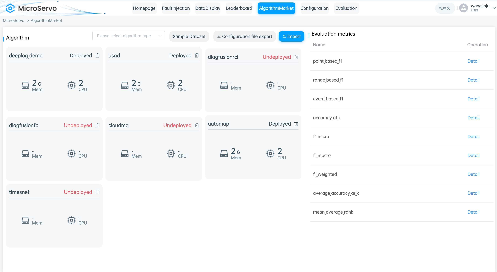
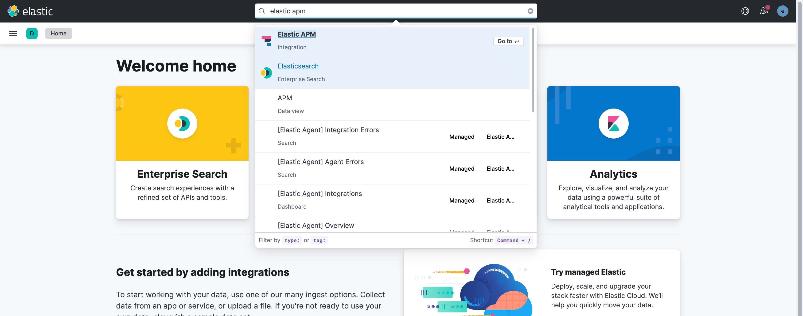
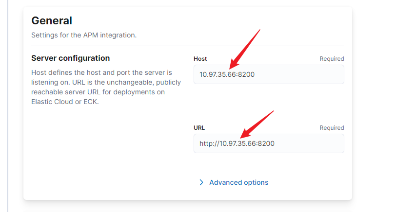
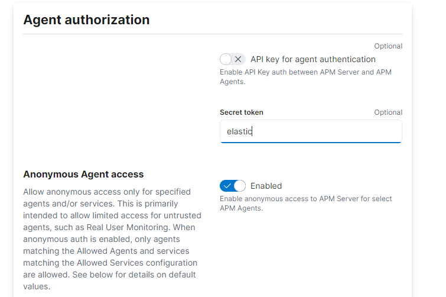

# MicroServo

## Introduction

MicroServo is a comprehensive benchmarking framework designed for microservices systems, featuring three modes of data collection (logs, tracing, and performance metrics), customizable fault injection, and support for online algorithm deployment. This framework provides researchers and developers with a practical tool to generate, monitor, and diagnose various fault scenarios in a simulated production environment, while also testing and developing new algorithms.



## Purpose

The primary goal of MicroServo is to enhance the resilience and efficiency of microservices systems. By offering detailed fault simulation and data collection tools, MicroServo enables researchers and industry practitioners to assess and optimize their systems and algorithms in a controlled environment, ensuring the stability and scalability of microservices architectures.

## Features

- Data Monitoring: MicroServo can automatically collect logs, traces, and performance metrics from microservices systems, processing them into labeled datasets for analysis and model training.
- Fault Injection: Users can customize fault types and parameters using MicroServo to inject faults and test the system's recovery capabilities and the effectiveness of fault detection algorithms.
- Online Algorithm Deployment: MicroServo supports the uploading and deployment of custom algorithms, enabling online algorithm testing and adjustment to enhance research and development efficiency and algorithm performance.


## Installation and Deployment

### Cluster

1. Install Cluster Management Tools and Dependencies

Run 1.install_dep.sh from doc_addons to install minikube, docker, kubectl, helm.

```
bash 1.install_dep.sh
```
> If you encounter system or network issues during command execution, you can manually install the above tools.

2. Deploy a Single Node Cluster Using minikube

Execute 2.deploy_instance.sh from doc_addons to deploy the minikube cluster.

```
bash 2.deploy_instance.sh
```
> You may adjust the minikube configuration within the script.
> If a proxy is needed, execute the 2.deploy_instance_proxy.sh script.

After installation, run minikube --profile your_profile_name status to verify if the minikube cluster is successfully deployed.
> Running minikube ssh allows you to log into the cluster virtual machine.

### Observability Tools

1. Install mysql

Install MySQL using Docker, with container name as mysql-container and password as your_password, recommended version is MySQL 5.7.

```SQL
docker run -d --name mysql-container -e MYSQL_ROOT_PASSWORD=elastic -p 3306:3306 mysql:5.7
```

Then modify the MySQL character set configuration and restart mysql.

> If using mysql:5.7 or higher, also modify sql_mode to support null values.

2. Create chaos_mesh Database

```Bash
docker exec -it mysql-container bash
mysql -u root -pelastic
CREATE DATABASE chaos_mesh;
```

3. Execute 3.observatory.sh from doc_addons to install apm-server, elasticsearch, filebeat, logstash, prometheus, chaosmesh, kibana, istio.

First, modify the dashboard.env.DATABASE_DATASOURCE field in the script with the IP and port number from step 1.

```
bash 3.observatory.sh
```
> Run kubectl get pods -n observe, kubectl get pods -n istio-system to check installation status.

4. Perform Port Forwarding

Execute 5.port_forward.sh from doc_addons to map the ports of elasticsearch, prometheus, chaosmesh, kibana to the server's ports.Ports are: elasticsearch at 9200, prometheus at 9090, chaosmesh at 2333, kibana at 5601.

```
bash 5.port_forward.sh
```
> If there are conflicts, ports can be changed as needed.

5. Add elastic apm to elasticsearch

- Search for elastic apm in the Kibana search bar.



- Configure the IP of the APM-server.Execute kubectl get svcs -n observe to view the IP of apm-server.



- Configure the secret: (Note, please set the secret to elastic, do not change to another value.)



### Microservice System

1. Build Images

Modify REPO_PREFIX in make-docker-images.sh to your own docker repository.Execute make-docker-images.sh from onlineboutique/hack to build images for different microservices.

```
bash make-docker-images.sh
```

2. Deploy Microservices

Modify faultinjectionplatform/helm-chart/values.yaml, setting images.repository and images.tag to match those in step 1.

From faultinjectionplatform, run:

```
helm install onlineboutique -n default ./helm-chart
```
> Execute kubectl get pods to check installation status.

### Backend

1. Create conda EnvironmentModify the prefix field in environment.yml within platform_backend to the new environment name you prefer.

```
conda env create -f environment.yml
conda activate XXXX
```

2. Create Database

```Bash
docker exec -it mysql-container bash
mysql -u root -pelastic
CREATE DATABASE work;
```

3. Configure Django and MySQL Connection

In platform_backend/platform_backend/settings.py, update the configuration details.

```Python
DATABASES = {
    'default': {
        'ENGINE': 'django.db.backends.mysql',
        'NAME': 'work',
        'USER': 'root',
        'PASSWORD': 'elastic',
        'HOST': 'mysql_container_ip',
        'PORT': '3306',
    }
}
```

4. Modify config.yaml for prometheus and elasticsearch URLs

5. Apply Database Schema Migrations

```Bash
python manage.py migrate
```

6. Run the Django Server

```Bash
python manage.py runserver 0.0.0.0:Your_port
```

### Frontend

1. Set Up node and npm

2. Modify target Field in platform_frontend/config/index.js to Your_port

3. From platform_frontend, execute:

```
npm install
npm run dev
```

## Possible Issue

### Kibana Proxy Configuration

If deploying Kibana internally, you may need to configure a proxy.

> 1. Add xpack.fleet.registryProxyUrl in kibana.yml:
>   kibanaConfig:
>   kibana.yml: |
>       xpack.fleet.registryProxyUrl: "your-nat-gateway.corp.net"
> 2. Add NOD_EXTRA_CA_CERTS in extraEnvs:
>   NODE_EXTRA_CA_CERTS="/etc/kibana/certs/ca-cert.pem"

### Image Building Proxy Issue

Before building images, if you are within an internal network, you may need to replace the image source via a script.

However, if a proxy is configured on the server, you can add the proxy settings to each microservice's Dockerfile. If image fetching issues persist during build, consider changing the source.
